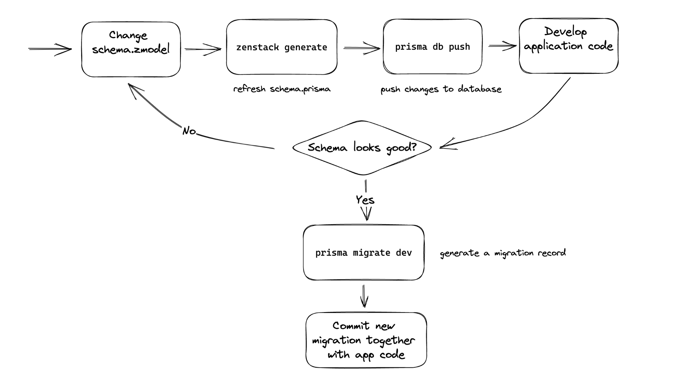

# Recipes

## Development Workflow



## Authentication Integration

- The code for Auth.js and ZenStack integration is just

```ts
import { auth } from '~/auth';
import { prisma } from '~/db';
import Post from '~/components/Post';

export default function Page() {
  const authObj = await auth();
  const db = enhance(prisma, { user: authObj?.user });
  const posts = await db.post.findMany()

  return (
    <div>
      {posts.map((post) => (
        <Post key={post.id} value={post} />
      ))}
    </div>
  );
}
```
